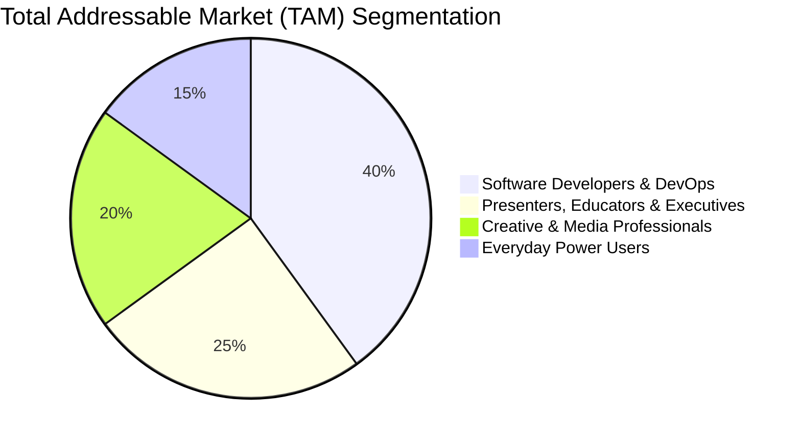

# 💼 Business Requirements Document (BRD)

## Document Metadata
* **Product Name**: Caffeinate for macOS
* **Version**: 1.1.0
* **Document Status**: Production Strategy & Commercial Architecture
* **Target Ecosystem**: Apple macOS & Mac App Store / Independent Distribution
* **Prepared By**: Senior Product Architect & Commercialization Lead

---

## 1. Executive Summary & Business Opportunity

The macOS sleep management and wake-lock utility category represents one of the most consistently utilized toolsets across Apple's 100+ million active desktop and laptop users. Tasks such as cloud synchronization, software compilation, video transcoding, presentation delivery, and remote machine access frequently require overriding default energy-saving policies.

However, the existing market landscape is characterized by aging architectures:
* **Legacy Tools (e.g. Caffeine)**: Largely unmaintained, lack modern UI, and fail to support current macOS display architectures.
* **Complex Utilities (e.g. Amphetamine)**: Extremely feature-dense with convoluted triggers, rules engines, and legacy AppKit panels that intimidate general and business users.
* **Modern Gap**: None of the established market leaders provide native **macOS Sonoma/Sequoia Desktop & Notification Center Widgets** combined with modern SwiftUI frosted glass interfaces and automated low-battery hardware safeguards.

**Caffeinate** capitalizes on this market opportunity by delivering a pristine, native Swift 6 application that pairs effortless single-click operation with modern widgets, elegant visual design, and zero performance penalty.

---

## 2. Competitive Benchmarking Matrix

| Feature / Attribute | **Caffeinate** (Ours) | **Amphetamine** | **Caffeine** (Legacy) | **Lungo** | **macOS `caffeinate` CLI** |
| :--- | :---: | :---: | :---: | :---: | :---: |
| **Kernel Power Assertions** | **Native In-Process IOKit** | In-Process IOKit | Subprocess wrapper | Native API | Native CLI |
| **First-Launch Popup Dashboard** | ✅ **Yes (SwiftUI)** | ❌ No | ❌ No | ❌ No | ❌ No |
| **macOS Desktop & Sidebar Widgets** | ✅ **Yes (WidgetKit)** | ❌ No | ❌ No | ❌ No | ❌ No |
| **Menu Bar Widget Popover** | ✅ **Yes (Interactive)** | ❌ Complex Menu | ❌ Basic Menu | ⚠️ Limited | ❌ None |
| **Dual Sleep Modes (Display vs System)** | ✅ **Yes** | ✅ Yes | ❌ Display only | ❌ Limited | ✅ Yes (`-d` / `-s`) |
| **Low Battery Safety Cutoff ($\le 20\%$)** | ✅ **Automated (`IOKit.ps`)**| ✅ Custom Triggers | ❌ None | ⚠️ Basic | ❌ None |
| **Memory Footprint (RSS)** | **~25 MB** | ~60 MB | ~15 MB | ~30 MB | ~5 MB |
| **Binary Payload Size** | **< 1.5 MB** | ~15 MB | ~3 MB | ~8 MB | Built-in |
| **Telemetry / Data Collection** | **0% (100% Private)** | 0% | 0% | 0% | 0% |
| **App Store Pricing Model** | Free / Open / Pro | Free / Donations | Free (Defunct) | \$2.99 Paid | Free |

---

## 3. Market Sizing & Audience Segments

### Market Sizing
* **Total Addressable Market (TAM)**: Global active macOS user base (~100+ Million active machines).
* **Serviceable Available Market (SAM)**: Active developers, content creators, and remote corporate knowledge workers who frequently run long-duration jobs or lead presentations (~25 Million users).
* **Serviceable Obtainable Market (SOM)**: Power users seeking modern macOS Sonoma/Sequoia widget integration and native Apple Silicon efficiency (~500,000 to 1,000,000 users).

---

## 4. Commercialization & Distribution Models

Caffeinate is engineered to support multiple strategic go-to-market motions:

### Option A: Free & Open-Source Community Standard (Mindshare Engine)
* **Structure**: Apache 2.0 or MIT license hosted on GitHub with Homebrew Cask distribution (`brew install --cask caffeinate`).
* **Monetization**: GitHub Sponsors, developer tips, and brand authority driving enterprise consulting and software engineering visibility.

### Option B: Mac App Store Tiered Model (Direct Monetization)
* **Tier 1 (Free Core)**:
  - Menu bar icon, one-click toggle, standard duration presets, and basic desktop widget.
* **Tier 2 (Pro Pack — \$2.99 to \$4.99 One-Time Purchase)**:
  - Custom duration sliders, advanced battery threshold customization (10% to 50%), and exclusive widget visual themes.
* **Revenue Projection**: At a 3% conversion rate across 200,000 downloads, generates \$18,000 – \$30,000 net revenue per year with zero marginal server costs (100% on-device).

### Option C: Enterprise / MDM Fleet Deployment (B2B Licensing)
* **Use Case**: Corporate Mac fleets in conference rooms, digital signage, kiosks, and engineering labs.
* **Feature**: Silent configuration via `.mobileconfig` / MDM configuration profiles setting organization-wide sleep enforcement.

---

## 5. Key Performance Indicators (KPIs) & Success Metrics

| Category | Primary Metric | Target / Benchmark | Business Objective |
| :--- | :--- | :--- | :--- |
| **Stability** | Crash-Free Session Rate | $\ge 99.95\%$ | Ensure zero disruption during mission-critical presentations and renders. |
| **Efficiency** | Battery Degradation Rate | $0.0\%$ idle penalty | Eliminate user complaints regarding background energy drain. |
| **Engagement** | 30-Day Retention ($D_{30}$) | $\ge 65\%$ | Establish Caffeinate as a permanent fixture in the user's daily menu bar. |
| **Customer Satisfaction** | Mac App Store Rating | $\ge 4.8 / 5.0$ stars | Outrank legacy competitors through superior UI aesthetics and widget support. |
| **Support Overhead** | Monthly Support Inquiries | $< 0.1\%$ of active base | Intuitive first-launch dashboard minimizes user configuration errors. |

---

## 6. Privacy, Security & Regulatory Compliance

* **Zero Telemetry**:
  - The binary links zero network frameworks (`CFNetwork`, `URLSession`, or third-party analytics trackers are entirely absent).
  - 100% on-device computation satisfies the strictest corporate data security policies (HIPAA, GDPR, SOC 2, and defense contractor workstations).
* **Mac App Store Sandbox Compliance**:
  - All power management assertions utilize documented public Apple IOKit APIs (`IOPMAssertionCreateWithName`).
  - Cross-process communication uses standard sandboxed container paths and `WidgetKit` conventions.
* **Apple Notarization**:
  - Automated ticket stitching via `notarytool` ensures seamless, warning-free Gatekeeper installation on macOS.

---

## 7. Business Risk Assessment & Mitigation

| Risk Vector | Likelihood | Impact | Mitigation Strategy |
| :--- | :---: | :---: | :--- |
| **macOS Power Management API Deprecation** | Low | High | Apple's Darwin kernel relies directly on `IOPMAssertion` for all first-party background tasks. Any API shift will be tracked during Apple WWDC beta cycles. |
| **Market Saturation by Free Alternatives** | Medium | Medium | Differentiate through premium UI aesthetics, first-launch dashboard onboarding, and native macOS desktop widgets that competitors lack. |
| **Accidental Battery Depletion Complaints** | Low | High | Enforce automated low-battery cutoff at $\le 20\%$ by default with immediate notifications. |
| **App Store Review Rejection** | Low | Medium | Strict adherence to Apple Human Interface Guidelines (HIG) and sandbox entitlements. |
