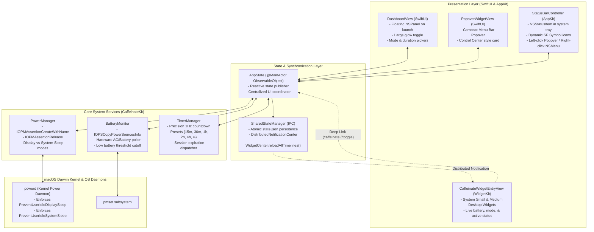

# 🛠️ Caffeinate: Developer & Architecture Manual

## 1. Architectural Overview & System Design

`Caffeinate` is designed as a modular, high-performance macOS system utility. Rather than executing the external `/usr/bin/caffeinate` CLI command as a subprocess, the application communicates directly with the macOS Darwin kernel via the **IOKit** power management subsystem (`IOKit.pwr_mgt` and `IOKit.ps`).

### High-Level Architecture Diagram



---

## 2. Core Subsystems Deep Dive

### 2.1 Power Management Engine (`PowerManager.swift`)
* **Framework**: `IOKit.pwr_mgt`
* **C APIs Used**:
  - `IOPMAssertionCreateWithName(CFString, IOPMAssertionLevel, CFString, *IOPMAssertionID) -> IOReturn`
  - `IOPMAssertionRelease(IOPMAssertionID) -> IOReturn`
* **Assertion Types Supported**:
  - `kIOPMAssertionTypePreventUserIdleDisplaySleep`: Prevents both the display and system from sleeping. Ideal for presentations, screen monitoring, or video playback.
  - `kIOPMAssertionTypePreventUserIdleSystemSleep`: Allows the display to turn off while keeping CPU, networking, audio, background jobs, and disk I/O active.
* **Concurrency & Safety**:
  - Uses an internal `NSLock` to prevent race conditions during rapid toggles.
  - Registers `deinit` hooks and POSIX signal handlers (`SIGINT`, `SIGTERM`) to guarantee that any active assertion is immediately released when the app exits or terminates.

### 2.2 Hardware Battery Monitor (`BatteryMonitor.swift`)
* **Framework**: `IOKit.ps`
* **APIs Used**:
  - `IOPSCopyPowerSourcesInfo() -> CFTypeRef?`
  - `IOPSCopyPowerSourcesList(CFTypeRef) -> CFArray?`
  - `IOPSGetPowerSourceDescription(CFTypeRef, CFTypeRef) -> CFDictionary?`
* **Keys Inspected**:
  - `kIOPSTypeKey`: Identifies `kIOPSInternalBatteryType`.
  - `kIOPSCurrentCapacityKey` and `kIOPSMaxCapacityKey`: Computes precise integer percentage $\lfloor (\text{current} / \text{max}) \times 100 \rfloor$.
  - `kIOPSIsChargingKey`: Boolean indicating active AC battery charging.
  - `kIOPSPowerSourceStateKey`: Compares against `kIOPSACPowerValue`.
* **Low Battery Safety Cutoff**:
  - Configurable threshold (default: $20\%$).
  - When discharging on battery and level drops to $\le 20\%$, `onLowBatteryTriggered` is dispatched on the main thread, causing `PowerManager` to release assertions and `UserNotifications` to alert the user.

### 2.3 Precision Timer Subsystem (`TimerManager.swift`)
* **Operation**:
  - Accepts standard `DurationOption` presets (`.indefinite`, `.minutes(15)`, `.minutes(30)`, `.minutes(60)`, `.minutes(120)`, `.minutes(240)`).
  - Calculates target `expirationDate = Date().addingTimeInterval(seconds)`.
  - Runs a 1Hz `Timer` computing remaining seconds via `expirationDate.timeIntervalSinceNow`.
  - When remaining time hits $\le 0$, automatically invalidates the timer and invokes `onExpire()` to deactivate sleep prevention.

### 2.4 Cross-Process IPC & State Synchronization (`SharedStateManager.swift`)
Because macOS WidgetKit extensions run in a separate sandboxed extension process (`CaffeinateWidget.appex`), state cannot be passed via simple in-memory singletons.
* **Storage Location**: `~/Library/Application Support/Caffeinate/state.json`
* **Serialization**: Swift `Codable` via `JSONEncoder` / `JSONDecoder` with atomic file writes.
* **Event Dispatching**:
  1. Main app modifies state (e.g. user toggles Caffeinate).
  2. `SharedStateManager.save(state:)` atomically writes `state.json`.
  3. Posts a cross-process notification via `DistributedNotificationCenter.default().postNotificationName(...)`.
  4. Triggers `WidgetCenter.shared.reloadAllTimelines()`, forcing WidgetKit to refresh all desktop and notification center widgets within milliseconds.

---

## 3. User Interface Architecture

### 3.1 First-Launch Popup Dashboard (`DashboardView.swift` & `DashboardWindowController.swift`)
* **Window Mechanism**:
  - Custom `NSPanel` configured with:
    - `styleMask: [.titled, .closable, .miniaturizable, .fullSizeContentView, .nonactivatingPanel]`
    - `isFloatingPanel = true`, `level = .floating`
    - `titlebarAppearsTransparent = true`
    - `isMovableByWindowBackground = true`
* **Vibrancy**: Utilizes `NSVisualEffectView` with `.hudWindow` material and `.behindWindow` blending mode for a native macOS frosted glass aesthetic.
* **Auto-Launch Logic**:
  - `AppDelegate.applicationDidFinishLaunching` checks `AppState.shared.showOnLaunch`. If true, displays the dashboard window centered on the user's primary display.

### 3.2 Menu Bar Controller (`StatusBarController.swift`)
* **Status Item**: Configured with `NSStatusItem.variableLength`.
* **Icons**: Template SF Symbols (`cup.and.saucer` when inactive; `cup.and.saucer.fill` when active).
* **Dual Event Routing**:
  - **Left Click**: Toggles or slides down the interactive `NSPopover` hosting `PopoverWidgetView`.
  - **Right Click / Option-Click / Control-Click**: Pops the traditional AppKit `NSMenu` with direct actions, sleep mode selection, and "Quit Caffeinate".

### 3.3 macOS WidgetKit Extension (`CaffeinateWidget.swift`)
* **Extension Type**: Standalone `WidgetBundle` targeting macOS 14.0+.
* **Bundle Location**: `build/Caffeinate.app/Contents/PlugIns/CaffeinateWidget.appex`.
* **Supported Families**:
  - `.systemSmall`: Compact square widget displaying glowing cup, active status, duration, and battery.
  - `.systemMedium`: Expanded widget with dual columns for detailed status, mode pill, duration, and battery meter.
* **Interactive Deep Linking**: Configured with `.widgetURL(URL(string: "caffeinate://toggle"))`. Tapping the widget opens the URL scheme, which `AppDelegate.application(_:open:)` catches to toggle state instantly.

---

## 4. Build, Packaging & Code Signing Pipeline

### Packaging Script (`scripts/build_app.sh`)
The automated script handles the complete build lifecycle:
1. **Compiles Main Binary**: `swift build -c release --product Caffeinate`
2. **Assembles Application Bundle**:
   - Creates `build/Caffeinate.app/Contents/MacOS`
   - Copies binary into place and sets `+x` permissions.
3. **Embeds Resources**:
   - Copies `Resources/AppIcon.icns` to `Contents/Resources/AppIcon.icns`.
   - Copies `Resources/app_logo.png` to `Contents/Resources/app_logo.png`.
4. **Compiles WidgetKit Extension**:
   ```bash
   swiftc -O -parse-as-library -target arm64-apple-macos14.0 \
     -framework WidgetKit -framework SwiftUI -framework AppKit \
     Sources/CaffeinateWidget/CaffeinateWidget.swift \
     -o build/Caffeinate.app/Contents/PlugIns/CaffeinateWidget.appex/Contents/MacOS/CaffeinateWidget
   ```
5. **Generates Metadata & Info.plist**:
   - Sets `LSUIElement = true` (Menu Bar exclusive, hidden from Dock).
   - Registers URL scheme `caffeinate://`.
   - Registers `NSExtensionPointIdentifier = com.apple.widgetkit-extension`.
6. **Applies Code Signature**:
   ```bash
   codesign -s - --force --deep build/Caffeinate.app
   ```

---

## 5. Automated Testing & Verification

### Test Runner (`Sources/CaffeinateTestRunner/main.swift`)
Run via:
```bash
swift run CaffeinateTestRunner
```

The test runner verifies 8 core test suites without requiring Xcode:
1. `testPowerManagerActivationAndDeactivation`: Validates assertion creation, mode switching, and clean release.
2. `testPowerManagerToggle`: Validates toggle state transitions.
3. `testBatteryStatusFormatting`: Tests AC vs. battery discharging vs. charging string outputs.
4. `testBatteryMonitorHardwareDetection`: Reads live hardware capacity and verifies range $0 \le \text{level} \le 100$.
5. `testDurationPresetsAndFormatting`: Verifies minute-to-second conversions and string formatting.
6. `testTimerManagerLifecycle`: Verifies timer countdown, active status, and stop handling.
7. `testSystemPmsetIntegration`: Activates assertion and verifies that `/usr/bin/pmset -g assertions` reports `PreventUserIdleDisplaySleep` registered to Caffeinate's PID in the Darwin `powerd` daemon, then confirms removal upon deactivation.
8. `testSharedStateManagerPersistence`: Verifies cross-process JSON encoding and atomic disk reads.

---

## 6. Debugging & Diagnostic Commands

### Inspect System Assertions in Real Time
```bash
pmset -g assertions
```
Look for:
```text
pid <PID>(Caffeinate): [...] PreventUserIdleDisplaySleep named: "Caffeinate Sleep Prevention"
```

### Inspect Cross-Process State File
```bash
cat ~/Library/Application\ Support/Caffeinate/state.json | jq .
```

### Stream Live Unified Logging for Caffeinate
```bash
log stream --predicate 'subsystem CONTAINS "caffeinate" OR process == "Caffeinate"' --level debug
```

### Trigger Deep Link Toggles from Terminal
```bash
open caffeinate://toggle
open caffeinate://dashboard
```
